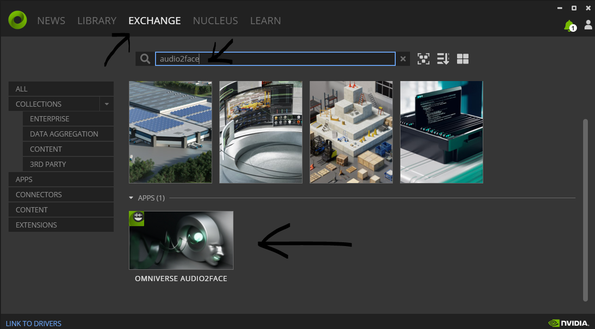
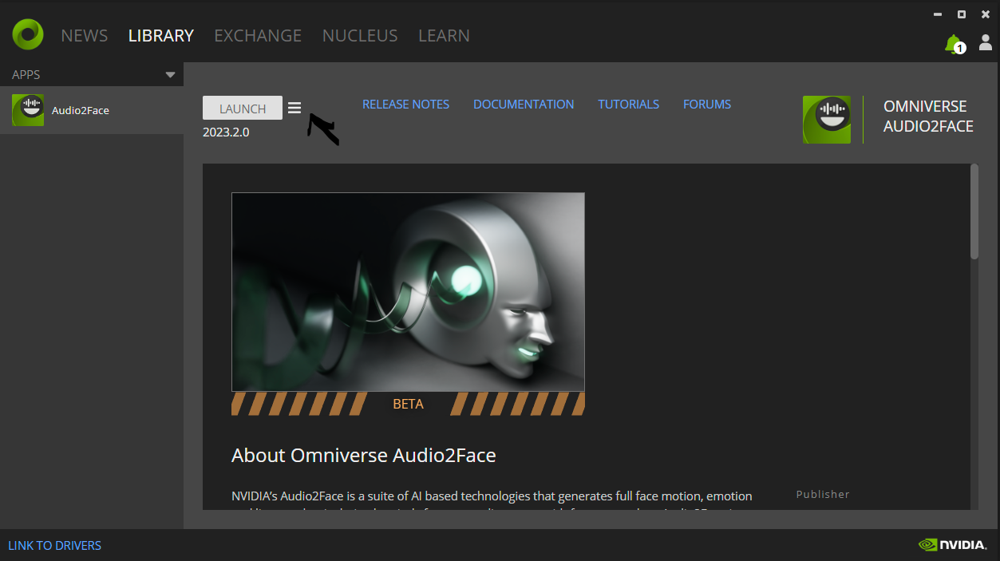
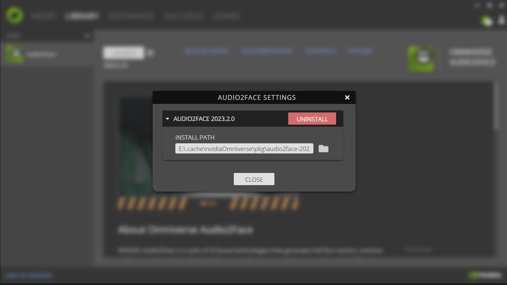

**0. Требования к ресурсам**
1 FHD сессия, кодировщик h264			
GPU	RTX 3060 12GB - 1	шт
CPU	4-5GHz cpu	- 14	cores
RAM	ddr4 or ddr5 -	16	GB
      
1 FHD сессия, кодировщик vp9			
GPU	RTX 3060 12GB	- 1	шт
CPU	4-5GHz cpu	- 16	cores
RAM	ddr4 or ddr5	- 16	GB


**1. Установить omniverse**

https://www.nvidia.com/en-in/omniverse/
https://docs.omniverse.nvidia.com/launcher/latest/installing_launcher.html#launcher-setup
https://install.launcher.omniverse.nvidia.com/installers/omniverse-launcher-win.exe

**1.1 Установить audio2face на omniverse**

После запуска NVIDIA Omniverse Launcher провести регистрацию и залогиниться

Выполнить действия на скриншотах - перейти в EXCHANGE, ввести в поиск audio2face, выбрать приложение, скачать и установить


Найти путь устанвоки audio2face. Нажать на бутерброд

Нажать settings

скопировать путь установки или перейти по нему


Запустить 
`audio2face_headless.bat`

После записи в логе 
`app ready`
вызвать следующие запросы


Запрос на запуск проекта, путь указать ваш к talkingHeadOmniverseA2F.usd
`curl --request POST \
  --url http://localhost:8011/A2F/USD/Load \
  --header 'Content-Type: application/json' \
  --header 'accept: application/json' \
  --data '{
  "file_name": "D:/projects/talking head/talkingHeadOmniverseA2F.usd"
}'`

Запрос на активацию голосового потока, его нужно запустить только если активен стрим голосового потока. Так же запускать после запуска unreal приложения
`curl --request POST \
  --url http://localhost:8011/A2F/Exporter/ActivateStreamLivelink \
  --header 'Content-Type: application/json' \
  --header 'accept: application/json' \
  --data '{
  "node_path": "/World/audio2face/StreamLivelink",
  "value": true
}'`

**2. Запуск приложения с аватаром**

в папке windows запустить 1.run_PS.bat

в папке Windows\talkingHeadV2\Samples\PixelStreaming\WebServers\SignallingWebServer\platform_scripts\cmd 
в файле Start_SignallingServer.ps1 заменить на ваш stun сервер в строчке
`$peerConnectionOptions = "{ \""iceServers\"": [{\""urls\"": [\""stun:212.113.101.204:3478\""]}] }"`

запустить сервер сигналинга
`Start_SignallingServer.ps1`

проверить что работает аватар в браузере
http://127.0.0.1/ 

**3. Настройка asterisk**

Установить freepbx на отдельную виртуальную машину
https://www.freepbx.org/downloads/

Настроить Webrtc и номер обязательно с ssl сертификатом
https://docs.itgrix.ru/blog/nastroika-webrtc-v-asterisk-freepbx

Настроить ari Сервер. Cекция настройки Ari
https://wiki.merionet.ru/articles/monitoring-ustrojstv-cherez-ari-v-asterisk

Настроить транк до робота
https://wiki.merionet.ru/articles/freepbx13-nastroika-tranka

Настроить номер 1005 приложения Ari stasis
```
exten => 1005,1,NoOp()
 same =>      n,Stasis(appname
 same =>      n,Hangup()
```

**4. Запуск udp_to_grpc сервера**
Перейти в папку udp_to_grpc

Установить python 3

Установить библиотеки 
`pip install requests grpcio grpcio-tools`

В файле udp_server.py
Указать адрес сервера, где запущен audio2face в строке 
`A2F_GRPC = "localhost:50051"`

Запустить сервер через 
`run.bat`

**5. Запуск ari сервера**
Перейти в папку ari_server

Установить python строго версии 2.7
Установить библиотеки из ari_server/requirements.txt
`pip install -r requirements.txt`

Заменить в ari_server.py строку 
`client = ari.connect('http://192.168.0.18:8088', 'ari', 'ari')` 
указав ваш адрес запущенного asterisk и логин/пароль к ari

Заменить в 
`OUTGOING_ENDPOINT = "PJSIP/000836060@twin"`
номер и транк на котором настроен робот

Заменить в 
`UDP_SERVER = '192.168.0.104:12222'`
адрес вашего сервера, где запущен udp_to_grpc

Запустить 
`python ari_server.py`

**6. Развертывание frontend**
Разместить папку public на web сервере, например nginx обязательно с ssl сертификатом
прописать конфигурацию
```
location / {
  root /usr/share/nginx/Public;
}
```

В файле **871f3e36ff723c62.js**
заменить логин и пароль от номера Asterisk в строчке
`this.loginText="1001",this.passwordText="dddb53023d6e20a8278cbc4dc82a9efb"`

Заменить адрес до websocket вашего asterisk в строчке
`socket=new JsSIP.WebSocketInterface("wss://talkavatar.ru:8089/ws")`

в файле **index.js** найти и заменить 
`wss://talkavatar.ru:8443`
на ваш адрес SignallingServer из блока *Запуск приложения с аватаром*
его можно запроксировать так же через nginx обязательно с ssl сертификатом
```
location / {
  proxy_pass http://127.0.0.1:80;
}
```
Запустить nginx

Перейти на страницу с вашим доменным именем https://вашсервер.ru/index.html